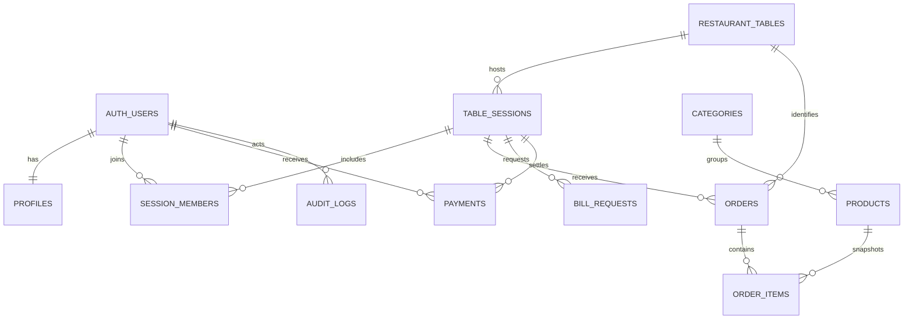

# ERD

```mermaid
erDiagram
  AUTH_USERS ||--|| PROFILES : has
  RESTAURANT_TABLES ||--o{ TABLE_SESSIONS : hosts
  TABLE_SESSIONS ||--o{ SESSION_MEMBERS : includes
  AUTH_USERS ||--o{ SESSION_MEMBERS : joins
  TABLE_SESSIONS ||--o{ ORDERS : receives
  RESTAURANT_TABLES ||--o{ ORDERS : identifies
  ORDERS ||--o{ ORDER_ITEMS : contains
  PRODUCTS ||--o{ ORDER_ITEMS : snapshots
  CATEGORIES ||--o{ PRODUCTS : groups
  TABLE_SESSIONS ||--o{ BILL_REQUESTS : requests
  TABLE_SESSIONS ||--o{ PAYMENTS : settles
  AUTH_USERS ||--o{ PAYMENTS : receives
  AUTH_USERS ||--o{ AUDIT_LOGS : acts
```

The order item stores a snapshot of the Arabic product name and unit price at order time. Later product edits do not alter historical receipts.
